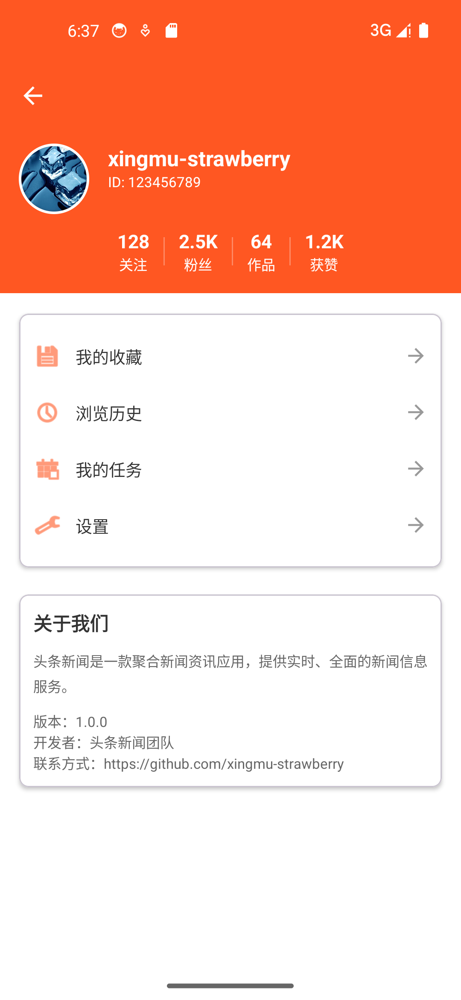
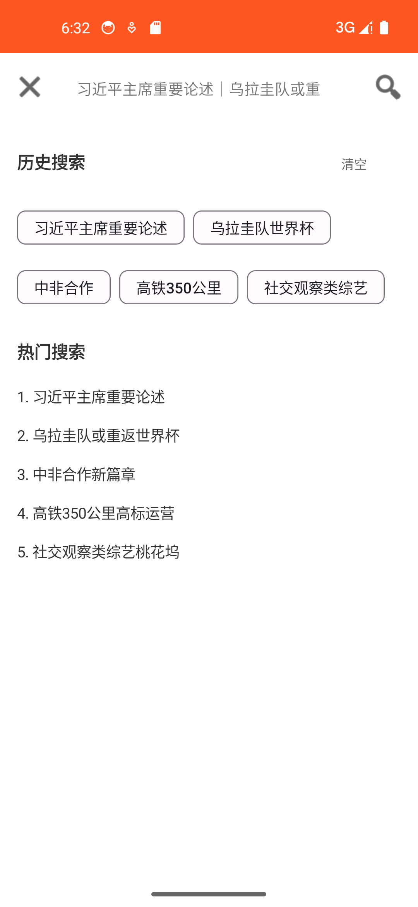
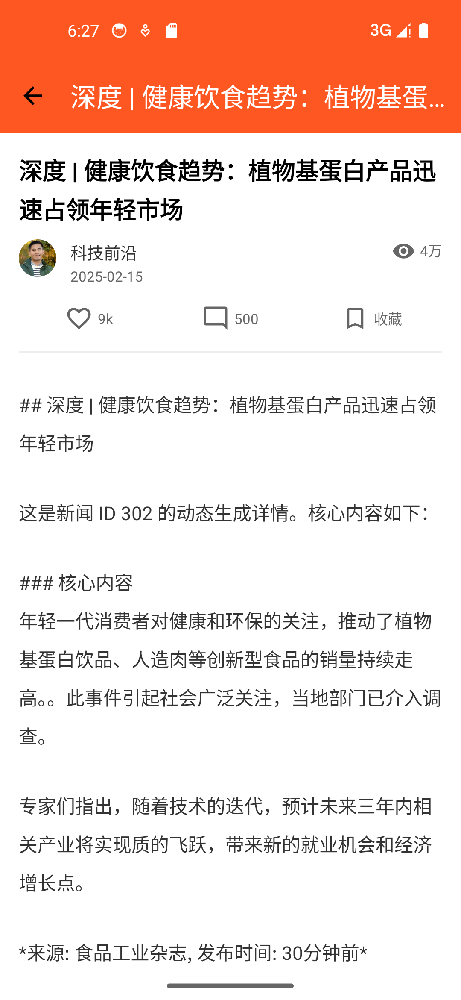
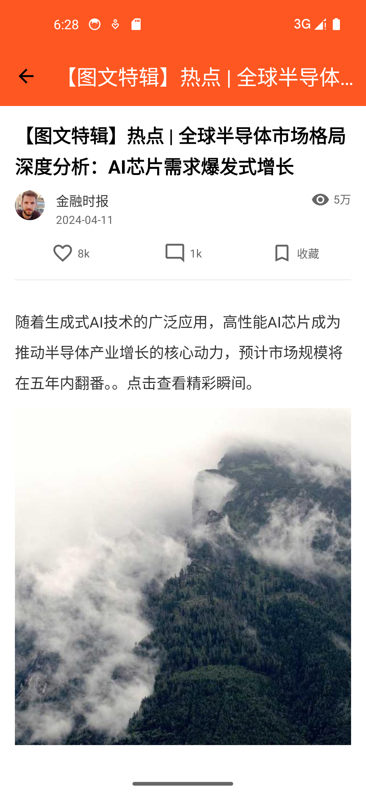
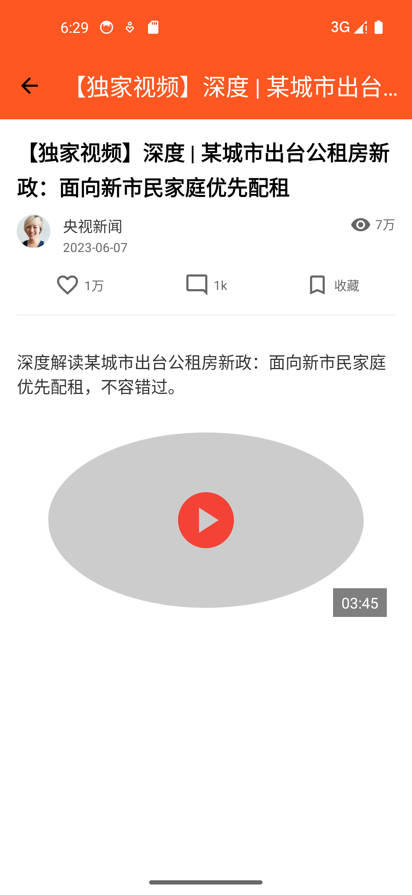
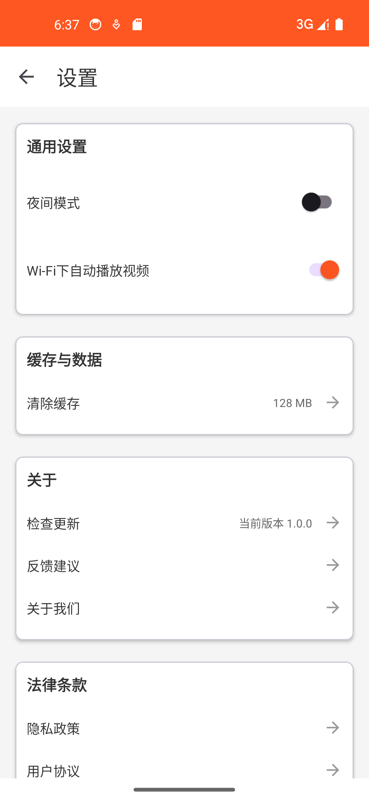
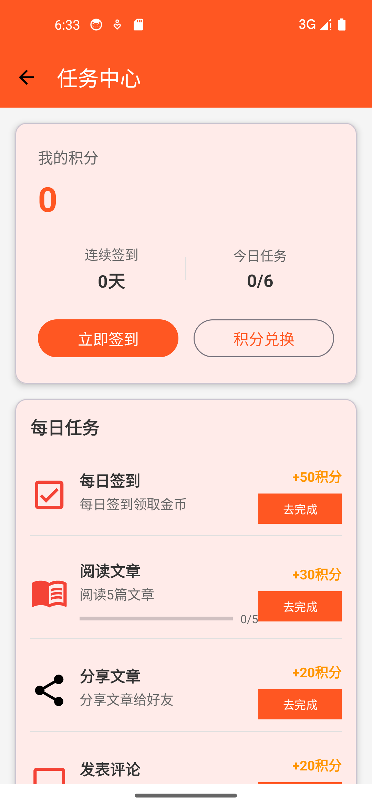
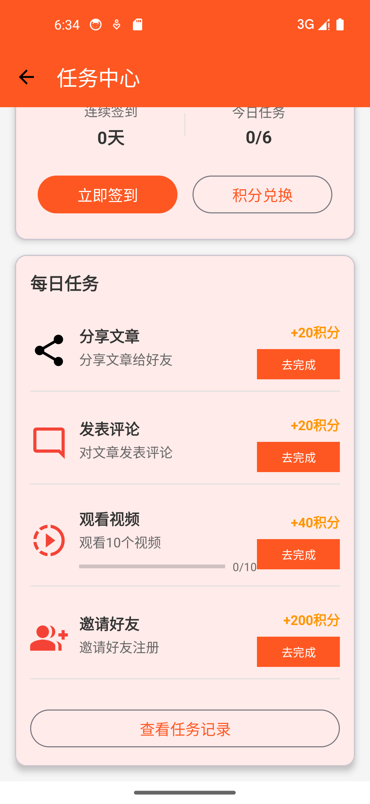
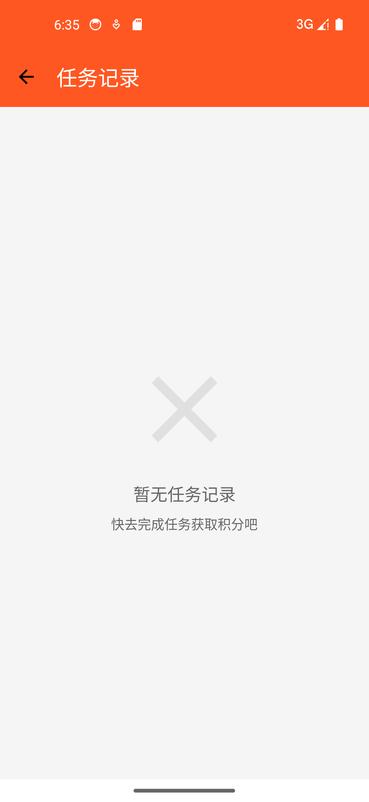
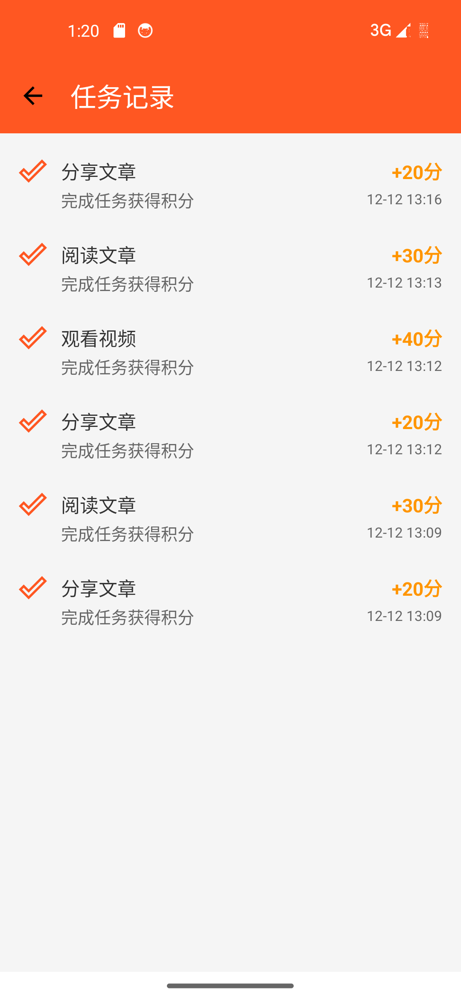

# 仿今日头条新闻列表项目

## 📱 项目简介
基于 Kotlin + MVVM 架构实现的仿今日头条首页新闻列表应用，包含完整的UI布局和核心功能，实现了多类型新闻展示、分类浏览、搜索、用户个人中心等功能模块。

## 🎯 功能特性
- ✅ 顶部天气栏和搜索栏（红色主题）
- ✅ TabLayout + ViewPager2 标签切换
- ✅ 四种新闻卡片类型（纯文字、图文、视频、长图）
- ✅ RecyclerView 多类型Item展示
- ✅ 底部导航栏（5个菜单项）
- ✅ MVVM 架构设计
- ✅ 搜索界面（实时搜索、历史记录、热门搜索）
- ✅ 个人中心页面（用户信息等）
- ✅ 新闻详情页（内容展示、互动功能）
- ✅ 设置页面（主题切换、缓存管理、关于信息）
- ✅ 图片加载优化（Glide）
- ⚠️ 网络请求层（Retrofit + OkHttp）（由于API限额，目前使用虚拟数据）
- ⚠️ 深色模式（目前未实现）

## 🏗️ 技术栈
- **语言**: Kotlin
- **架构**: MVVM + ViewBinding + Repository模式
- **UI组件**: ViewPager2, RecyclerView, TabLayout, BottomNavigationView, CoordinatorLayout
- **异步**: Kotlin协程
- **状态管理**: ViewModel + LiveData
- **网络请求**: Retrofit2 + OkHttp3 + Gson（已集成，但使用虚拟数据）
- **图片加载**: Glide
- **导航**: ViewPager2 + Fragment
- **数据绑定**: Data Binding
- **HTTP日志**: HttpLoggingInterceptor

## 📁 项目结构
```
Headlines/
├── data/                    # 数据层
│   ├── model/              # 数据模型
│   │   ├── News.kt         # 新闻首页数据模型
│   │   ├── NewsDetail.kt   # 新闻详情页数据模型
│   │   ├── MockData.kt     # 新闻虚拟数据
│   │   ├── Task.kt         # 任务页数据模型
│   │   ├── TaskHistory.kt  # 任务历史数据模型
│   │   └── ApiNewsResponse.kt # API响应模型
│   ├── mapper/             # 数据映射器
│   │   └── NewsMapper.kt   # API数据转换
│   ├── repository/         # 数据仓库
│   │   └── NewsRepository.kt # 数据访问层
│   └── remote/             # 网络层
│       ├── ApiService.kt   # API接口定义
│       └── RetrofitClient.kt # 网络客户端
│
├── ui/                     # UI层
│   ├── activities/         # Activity组件
│   │   ├── SearchActivity.kt       # 搜索页面
│   │   ├── NewsDetailActivity.kt   # 新闻详情页
│   │   ├── TaskActivity.kt         # 任务页
│   │   ├── TaskHistoryActivity.kt  # 任务历史页
│   │   ├── ProfileActivity.kt      # 个人中心页
│   │   └── SettingsActivity.kt     # 设置页面
│   ├── fragments/          # Fragment组件
│   │   ├── NewsFragment.kt         # 新闻列表Fragment
│   │   ├── NewsDetailFragment.kt   # 新闻详情列表Fragment
│   │   └── SearchResultFragment.kt # 搜索结果Fragment
│   ├── adapters/           # 适配器
│   │   ├── NewsAdapter.kt         # 新闻列表适配器
│   │   ├── NewsDetailAdapter.kt   # 新闻详情列表适配器
│   │   ├── TaskAdapter.kt         # 任务列表适配器
│   │   ├── TaskHistoryAdapter.kt  # 任务历史列表适配器
│   │   ├── ViewPagerAdapter.kt    # 主页面ViewPager适配器
│   │   ├── SearchPagerAdapter.kt  # 搜索页面适配器
│   │   └── viewholders/           # ViewHolder
│   │       ├── TextNewsViewHolder.kt        # 首页 - 文本新闻
│   │       ├── ImageNewsViewHolder.kt       # 首页 - 图片新闻
│   │       ├── VideoNewsViewHolder.kt       # 首页 - 视频新闻
│   │       ├── LongImageNewsViewHolder.kt   # 首页 - 长图新闻
│   │       ├── TextDetailViewHolder.kt      # 详情页 - 文本新闻
│   │       ├── ImageDetailViewHolder.kt     # 详情页 - 图片新闻
│   │       ├── VideoDetailViewHolder.kt     # 详情页 - 视频新闻
│   │       └── LongImageDetailViewHolder.kt # 详情页 - 长图新闻
│   └── viewmodel/          # ViewModel层
│   │   ├── NewsViewModel.kt        # 新闻首页业务逻辑
│       └── NewsDetailViewModel.kt  # 新闻详情页业务逻辑
│
└── res/                    # 资源文件
    ├── layout/             # 布局文件
    │   ├── activity_main.xml           # 主页面布局
    │   ├── activity_search.xml         # 搜索页面布局
    │   ├── activity_news_detail.xml    # 新闻详情页布局
    │   ├── activity_profile.xml        # 个人中心页面布局   
    │   ├── activity_settings.xml       # 设置页面布局
    │   ├── activity_task.xml           # 任务页面布局
    │   ├── activity_task_history.xml   # 任务历史页面布局
    │   ├── fragment_news.xml           # 新闻列表Fragment布局
    │   ├── fragment_search_result.xml  # 搜索结果Fragment布局
    │   └── item_news_*.xml             # 新闻列表项布局
    ├── drawable/           # 图形资源
    ├── menu/               # 菜单资源
    └── values/             # 值资源
```

## 🚀 快速开始
1. **克隆项目**: `git clone <repository-url>`
2. **打开项目**: 使用 Android Studio 打开项目
3. **同步项目**: 等待 Gradle 同步完成
4. **运行应用**: 连接设备或使用模拟器，点击运行按钮
5. **注意**: 项目目前使用内置虚拟数据，无需配置API密钥即可运行

## ⚙️ 配置说明

### 1. API配置（可选，目前使用虚拟数据）
如果需要使用真实的聚合数据API：
```properties
# local.properties 文件配置
JUHE_API_KEY=你的聚合数据API密钥
```
**注意**: 由于API调用限制，项目默认使用虚拟数据，如需切换真实API请修改相关配置。

### 2. 依赖版本
确保以下依赖版本兼容：
- compileSdk: 34
- minSdk: 24
- Kotlin: 1.8+
- Gradle: 8.0+

### 3. 权限配置
应用需要以下权限：
```xml
<uses-permission android:name="android.permission.INTERNET" />
<uses-permission android:name="android.permission.ACCESS_NETWORK_STATE" />
```

## 📸 功能演示

### 主界面功能
| 功能模块 | 说明 | 截图 |
|---------|------|------|
| **主界面** | 完整的首页布局，包含顶部栏、新闻列表、底部导航 |  |
| **新闻列表** | 多类型新闻卡片展示 |  |
| **个人中心** | 用户信息展示页面 |  |
| **搜索功能** | 实时搜索和搜索结果展示 |  |

### 新闻详情页展示
| 新闻类型 | 效果 | 说明       |
|----------|------|----------|
| **文本新闻** |  | 纯文字内容展示  |
| **图文新闻** |  | 图文混合展示   |
| **长图新闻** |  | 三张图片混合   |
| **视频新闻** |  | 视频内容播放   |
| **加载失败** |  | 获取新闻错误处理 |

### 其他功能页面
| 页面 | 功能 | 截图 |
|------|------|------|
| **设置页面** | 应用设置和偏好调整 |  |
| **任务界面** | 任务列表展示 |   |
| **任务历史** | 历史记录查看 |   |
| **视频页面** | 视频内容专区 |  |


## 📖 使用说明

### 浏览新闻
1. 打开应用进入首页
2. 滑动TabLayout切换新闻分类（推荐、热点、娱乐、体育等）
3. 点击新闻卡片查看详情
4. 在详情页进行点赞、收藏、分享等操作(暂无)

### 搜索功能
1. 点击顶部搜索框或底部导航"搜索"
2. 输入关键词实时搜索 （暂无法匹配）
3. 查看搜索历史和热门搜索推荐
4. 切换搜索结果分类（综合、文章、视频等）

### 任务功能
1. 查看任务列表，进入任务页面查看所有可完成任务
2. 查看任务历史，进入任务历史页面并查看已完成任务记录，任务完成时间和奖励

### 个人中心
1. 点击底部导航"我的"
2. 查看用户信息和统计
3. 访问我的收藏、浏览历史等功能 （暂无）
4. 进入设置页面调整应用偏好

### 设置功能
1. 在个人中心进入设置页面
2. 调整应用主题（目前只有浅色模式）
3. 管理缓存数据 （暂无）
4. 查看关于信息

## 🔄 更新日志

### v1.0.0 (当前版本)
- ✅ 基础框架搭建（MVVM + Kotlin）
- ✅ 主页面UI实现（天气栏、搜索栏、TabLayout）
- ✅ 四种新闻类型布局和适配器
- ✅ 底部导航栏功能
- ✅ 搜索功能实现
- ✅ 任务功能实现
- ✅ 个人中心和设置页面
- ✅ 新闻详情页面（多类型展示）
- ✅ 下拉刷新
- ✅ 网络层封装（Retrofit + OkHttp，备用）
- ✅ 虚拟数据系统（暂时解决API限制问题）

### 待实现功能
- 🔄 深色模式切换
- 🔄 上拉加载更多
- 🔄 新闻详情页文字内容的MarkDown格式渲染
- 🔄 完整的网络数据接入
- 🔄 视频播放器集成
- 🔄 数据库本地缓存

## 🤝 贡献指南

1. Fork 本仓库
2. 创建特性分支 (`git checkout -b feature/AmazingFeature`)
3. 提交更改 (`git commit -m 'Add some AmazingFeature'`)
4. 推送到分支 (`git push origin feature/AmazingFeature`)
5. 开启一个 Pull Request

**贡献方向建议**:
- 实现深色模式
- 完善上拉加载
- 集成真实的API数据
- 优化UI交互体验
- 修复已知问题

## 📄 许可证

本项目仅供学习和交流使用，遵循以下原则：
- 禁止用于商业用途
- 禁止修改后重新分发作为商业产品
- 学习参考请注明出处

## 🌟 Star History

如果这个项目对你有帮助，请给个⭐️支持！

---

**感谢使用头条新闻应用！目前项目使用虚拟数据进行演示，如有问题或建议，欢迎提交Issue或参与贡献。**

**注意**: 项目中的截图均为实际运行效果，展示了完整的UI界面和交互流程。